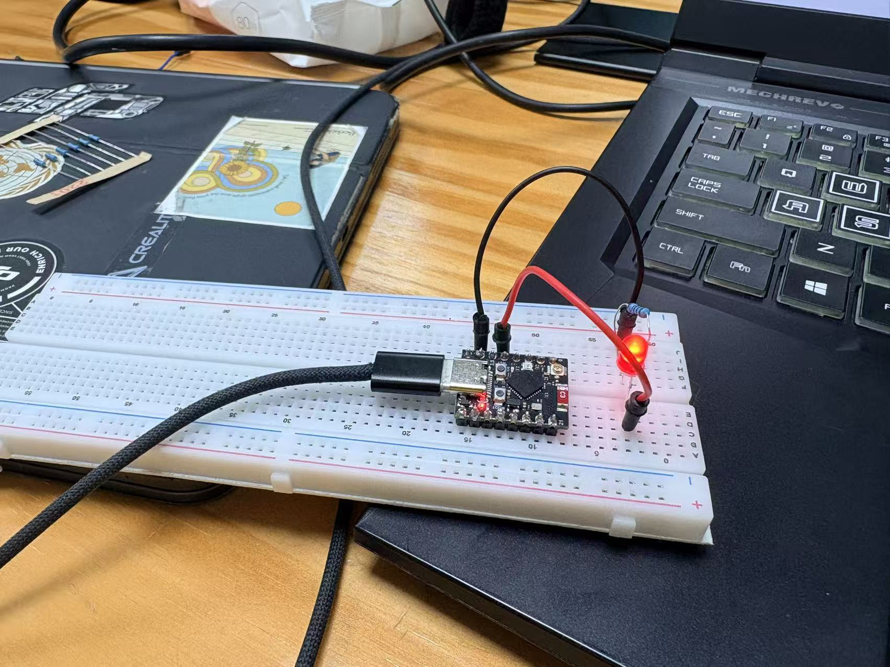

Homework 1

R1: group name:

github id

link:  [github.com/22335-a/desk-satellite-team3.git](https://github.com/22335-a/desk-satellite-team3.git)

R2: -40-70

R3: 20-20000

R4: 0.5mA 4.5-10V

R5: no because the voltage decrease lead to lower power of the microphone

R6: 0.1w under 70

R7: maximum voltage when R is miimum, so R=5/0.02=20Ohm

R8: the minimum bidrectional current that alows to flow in and out of and I/Opin when this pin is configured as high impedance input mode.

R9: r=100ohm

R10: through-hole axial resistor, resistance=22kohm,power over 0.5w

R11: current over 90mA

r12:

Readme questions (R): Type out answers or draw diagrams as required by the question. These are usually 2-3 line answers, a flowchart, or whatever else the assignment asks for.

Images (I): Photos you should include in your README.md (e.g., a photo of your assembled hardware).

Screenshots (S): Screenshots that also go into your README.md (e.g., your git commit history).

Code submissions (C): In your README.md, mention the file path that corresponds to a particular code submission if you do not use the suggested names.

Video submissions (V): Upload the video to Bilibili (recommended in China), Google Drive, or YouTube — if you choose YouTube, make it unlisted! — and provide the link in the README.md.

Check off from TA (T): You need to get this part checked off by a TA. You should do it during a lab session or any office hour to receive credit for this part. For team assignments, all team members should be present during the demo. The TA may ask questions regarding your demo.

r13: PDF, by using tool in VScode from .md

r14: pictures，word in readme.md file and code in repository

picture of the: 
