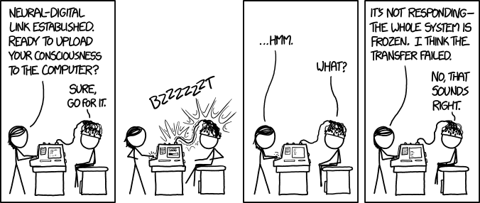
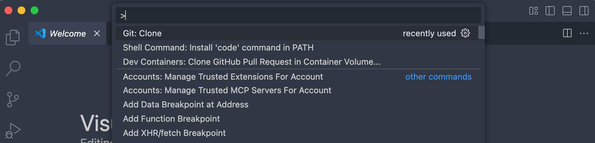
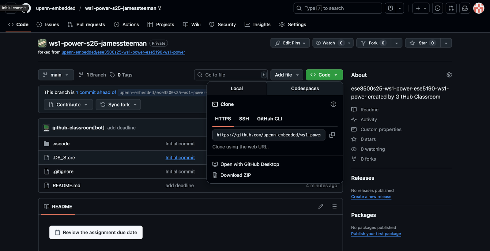
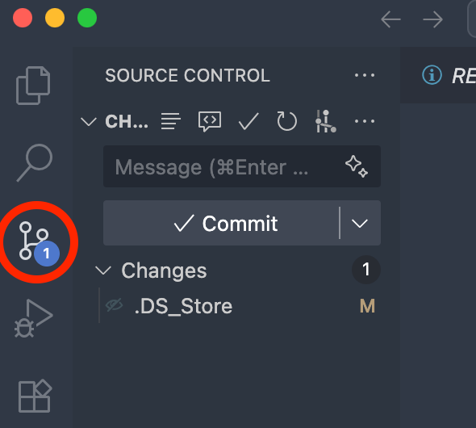
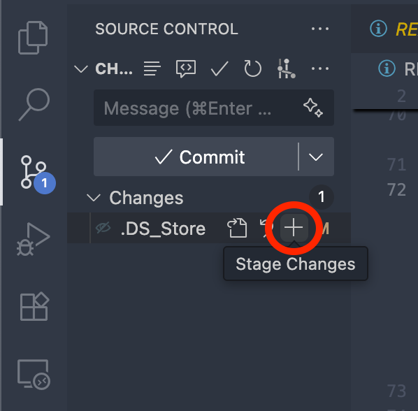
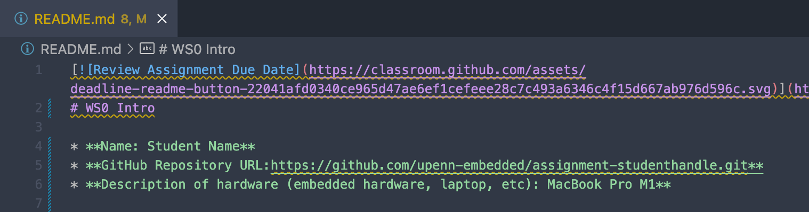
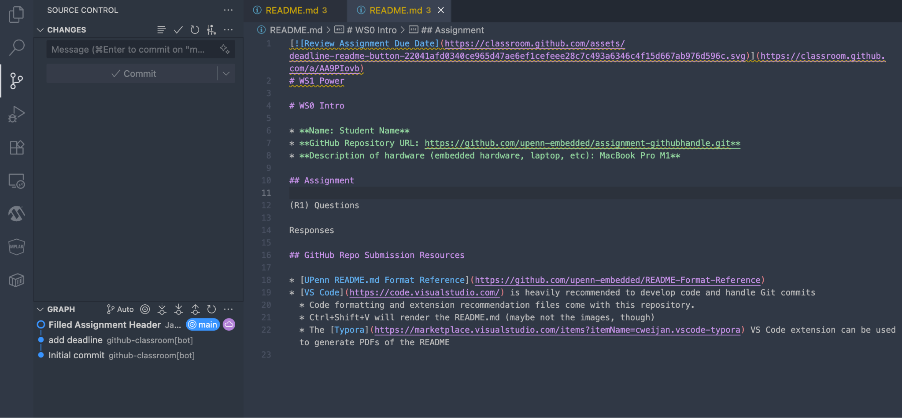
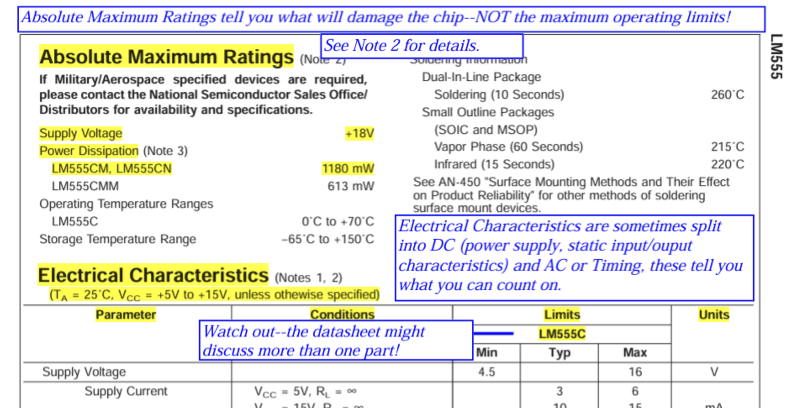
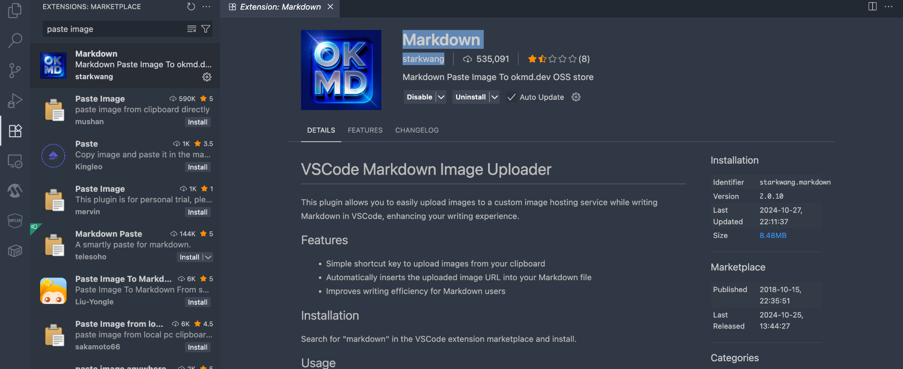

# Worksheet 0: Intro

Deadline: [instructor-set date]



*[https://xkcd.com/1666/](https://xkcd.com/1666/)*

# Overview

This worksheet introduces the assignment workflow and tools you will use throughout the Desk Satellite summer project: setting up a personal GitHub account and a self-built team repository, git basics for version control, reading datasheets and sourcing electronic parts from China-friendly distributors, and the README.md → PDF → email submission process.

**Note:** Required questions are tagged (R)/(I)/(S)/(C)/(V)/(T); important notes are called out as **Important:**.

This is an **individual + team** submission: you will commit your work to your team's GitHub repository, then export your README.md to a PDF and email it to the teaching team. If you have joined the course late, contact the teaching team for an extension.

# Task 1: Assignment Readme & Submission Format

This worksheet uses a tagging convention to label every submission deliverable so the teaching team can find your answers quickly. Learn it now — every worksheet and lab in this camp uses it.

The teaching team grades two components:

- The contents of your **README.md** file
- The **code** committed to your team repository

There are six types of submission items you will come across in your worksheets/labs:

- **Readme questions (R):** Type out answers or draw diagrams as required by the question. These are usually 2-3 line answers, a flowchart, or whatever else the assignment asks for.
- **Images (I):** Photos you should include in your README.md (e.g., a photo of your assembled hardware).
- **Screenshots (S):** Screenshots that also go into your README.md (e.g., your git commit history).
- **Code submissions (C):** In your README.md, mention the file path that corresponds to a particular code submission if you do not use the suggested names.
- **Video submissions (V):** Upload the video to Bilibili (recommended in China), Google Drive, or YouTube — if you choose YouTube, make it **unlisted**! — and provide the link in the README.md.
- **Check off from TA (T):** You need to get this part checked off by a TA. You should do it during a lab session or any office hour to receive credit for this part. For team assignments, all team members should be present during the demo. The TA may ask questions regarding your demo.

**How to tag in README.md:**

- In the assignment files, submission deliverables are tagged with the letter code and a number. For example, R1, R2, R3… C1, C2, C3… S1, S2, S3… and so on.
- In the README.md file, tag the submission item with the corresponding item code wrapped in parentheses on either side.
- Make sure there is only **one tag per line**.
- You may add anything else you want on the same line before or after the tag.
- You may also add the tag in headings — that works just the same.

For example, your README.md should look something like this:

```
(S1)
<insert screenshot here>
...
(R1)
Answer to R1
...
(C1) path/to/your_code_file.ino containing the answer to C1 in the repository
(R2) type another answer here
...
(S2) <insert another screenshot here>
(I1)
<insert image here>
```

**Code submission guidelines:**

- Keep your `setup()` / `loop()` functions as short as possible.
- Ideally, you should be able to put each code-submission question in a different `.ino` (or `.cpp` + `.h`) file, and call just one function inside `setup()`/`loop()`.
- The function you call in `setup()`/`loop()` can keep changing as you work through a lab — this will help you make progress without having to overwrite your previous work.
- You can create a common file for utility/helper functions and call those from the files that contain the core logic for each section. So your source code folder may look something like:
  - `desk_satellite.ino` (containing `setup()` and `loop()`, plus `#include`s from other files)
  - `display.ino` (core logic for the TFT display)
  - `sensor.ino` (core logic for the SHT31 sensor)
  - `config.h` (pin definitions, WiFi credentials, shared helpers)
- Talk to the TAs for input on how to organize your code! They're here to help.

# Task 2: Set up your GitHub Account & Team Repository

In this project, we use **git** for version control through the **GitHub** platform.

Version control is the practice of tracking and managing changes to source code over time. It stores every edit in a special database, allowing you to revert to earlier versions, develop in parallel with teammates without overwriting others' work, and keep a history of all changes — including who made the change and why they did so.

Git is the most widely used version control system. For the lab and worksheet assignments in this camp we use Git. This gives you experience with a professional-grade development workflow used in industry, and allows the teaching team to access your work.

**Important:** We recommend you **commit early and often**, which not only shows us proof of work, but also allows you to recover your work in case of issues, or revert to earlier code if additional development is unsuccessful.

We recommend using **VS Code** and its built-in git version tracking — it's the simplest way to develop, check differences, and push changes. Other options include the GitHub editor in a web browser, Git's command-line tools, and GitHub Desktop.

Written responses in assignments will be completed in your team repository's `README.md` file. Starter code files for each assignment are linked at the beginning of the assignment document; copy them into your team repository and add your own code files for grading.

## Create your personal GitHub account

1. Sign up for a **personal** GitHub account at [https://github.com/signup](https://github.com/signup) using any email address you can access (your school email, QQ mail, Gmail — anything works).
2. **Enable two-factor authentication (2FA)** on your account (Settings → Password and authentication). GitHub requires this, and it protects your work.
3. Check (Settings → Emails) that your email is **verified**.

## Form your self-built team

This project is built in teams. The project README recommends **pairs**: one teammate handles **circuit soldering**, the other handles **structural assembly**. Solo students are allowed — if you are solo, contact the teaching team about how the Collaboration dimension will be assessed for you.

1. Decide on your team (1–2 people). Pick a team name, e.g. `desk-satellite-team3`.
2. **One member** creates a new repository on GitHub:
   - Click the **+** in the top-right of github.com → **New repository**.
   - Name it (e.g. `desk-satellite-team3`).
   - Set it to **Private** (or Public if you prefer).
   - Check **Add a README file**.
   - Click **Create repository**.
3. **Invite your teammate(s):**
   - In the repo, go to **Settings → Collaborators → Add people**.
   - Enter your teammate's GitHub username and send the invite.
   - Your teammate accepts the invitation (it arrives by email and in their GitHub notifications bell).

   Alternatively, create a small **GitHub organization** for your team and put the repository there — this makes it easier to manage permissions if your team grows.

Once your repository is created, you can begin to make edits in the browser, or **clone** the repository as a local copy through VS Code. One way to clone your repository is to use the VS Code search bar (Ctrl+Shift+P / Cmd+Shift+P) and use `>` to input a command. We will use **Git: Clone**.



It will ask you to provide a repository URL, which you can copy from the GitHub web repository by clicking the green **Code** button and copying the link under **HTTPS**.



Save the repository in a location you desire on your machine, then open it in VS Code. Work for this and future assignments will be completed in the `README.md` file.

## Submission

(R1)
Once you have set up your GitHub account and created/cloned your team repository, add your **GitHub username(s)**, **team name**, and **repository URL** here in the README.md file.

# Task 3: Git Basics

You may use terminal commands or the buttons in VS Code / github.com to enact git commands in this class — use the method with which you are most comfortable.

The basic workflow is **add → commit → push**. If a teammate has made changes, use **pull** to obtain these changes in your local version.

After saving changed files:

**In the terminal**, use commands:

```
git add .
git commit -m "<your commit message here>"
git push
git pull
```

**In VS Code**, navigate to the Source Control panel (the branch icon on the left), then type a commit message in the "Message" text entry. Stage changes by pressing the **+** button for each specific change, or hover over the "Changes" dropdown and press its **+** button to stage all changes. To commit, press **Commit**, then push by pressing **Sync Changes** (which replaces the Commit button). To commit and push in one go, use the dropdown to the right of the Commit button and select **Commit and Push**. When you wish/need to pull, the Commit button will appear as **Sync Changes** — press **Sync Changes** to pull remote changes to the repository.





## Some Resources for Learning Git & GitHub

The best way to learn Git & GitHub is to use it — but these tutorials should also jump-start your progress.

- [Common Git Commands](https://docs.gitlab.com/topics/git/commands/)
- [Using Git source control in VS Code](https://code.visualstudio.com/docs/sourcecontrol/overview)
- [GitHub Skills — Get started with Git and GitHub](https://skills.github.com/)
- [A 1-2 hour crash course from Class Central (freeCodeCamp)](https://www.classcentral.com/course/freecodecamp-git-and-github-for-beginners-crash-course-89437)
- [Atlassian Git Tutorial](https://www.atlassian.com/git/tutorials)
- [Connecting to GitHub with SSH](https://docs.github.com/en/authentication/connecting-to-github-with-ssh)
- Prefer video? Search [Bilibili](https://search.bilibili.com/all?keyword=github+ssh) (recommended in China) or [YouTube](https://www.youtube.com/results?search_query=github+ssh+setup+tutorial) for "GitHub SSH setup tutorial" and pick a recent one in your preferred language.

## Submission

Add your **name(s)**, **repo URL**, and a **description of your hardware** in the README.md file. This assignment header is required in every assignment and is checked separately from the tagged rubric items below — you will lose points if this section is not filled in. Save your README.md file, and commit with the message **"Filled Assignment Header."** We will check your commit history.





(S1)
Include a screenshot of your commit history, similar to the one above, after committing with your filled assignment header.

See the [Appendix](#appendix) for information on including a screenshot in a markdown file in VS Code.

# Task 4: Datasheets and Part Distributors

## Reading Datasheets

Subsequent work in this project requires you to thoughtfully read and assess components through their **datasheets**. Datasheets are comprehensive documents that can be tens, hundreds, or thousands of pages long.

They can be overwhelming — where should you start to look for information? This [How to Read a Datasheet](https://www.egr.msu.edu/classes/ece480/capstone/read_datasheet.pdf) PDF might help you. It breaks down various parts of a datasheet and highlights important aspects.



Here's another good guide: [How to Read a Power MOSFET Datasheet](https://www.embeddedrelated.com/showarticle/809.php).

Good luck! May the power of datasheets be with you!

## Parts Distributors

The catalog of electronic components is vast. Where can you find and purchase the components you need? How can you ensure they meet your design constraints and specifications? How can you ensure they are not obsolete (no longer being produced)?

The answer is **electronics parts distributors**, such as [LCSC / 立创商城](https://www.lcsc.com/) and [Taobao / 淘宝](https://www.taobao.com/). [Octopart](https://octopart.com/) is a search engine for electronic components that looks across many distributors worldwide, giving you a bird's-eye view of the landscape. There are many others, and sometimes you can purchase directly from the manufacturer.

**Important:** For this project, you will primarily use **LCSC** and **Taobao** to find components in worksheet design questions and to order parts for your final project. **LCSC** ([lcsc.com](https://www.lcsc.com/)) is the parts arm of **JLCPCB** ([jlcpcb.com](https://jlcpcb.com/)) — the same company that fabricates custom PCBs — and it ships within China, so delivery is fast and cheap. JLCPCB itself is where you would order a custom PCB if you design one. Taobao is the default for one-off modules, wires, and tools. Octopart is handy as a cross-distributor search to compare specs and find alternate part numbers, even if you ultimately buy from LCSC.

## Submission

**Key terms used in this section:**

- **Electret microphone** — a common, low-cost microphone capsule found in many everyday devices.
- **Source / sink current** — the current a pin can supply out to a load (source) or draw in from a load (sink).
- **Vcc** — the MCU's positive supply voltage (the "high" rail that powers the chip).
- **Forward voltage** — the voltage dropped across an LED (or diode) when it is conducting current.
- **Through-hole** — a part with long leads that pass through drilled holes in the board and are soldered on the other side (vs. surface-mount parts, which sit flat on the surface).
- **Tolerance** — the allowed deviation from the nominal value (e.g. a 5% tolerance on a 22 kΩ resistor means the actual value lies between 20.9 kΩ and 23.1 kΩ).
- **Power rating** — the maximum heat a part can dissipate continuously without being damaged.

For questions R2–R5, use this [Electret Microphone datasheet](https://www.sameskydevices.com/product/resource/cmb-6544pf.pdf) (Same Sky Devices, manufacturer):

(R2)
What is the operational temperature range that the manufacturer claims the product will remain functional?

(R3)
What is the device frequency range?

(R4)
What is the current consumption (and under what conditions)?

(R5)
If you change the input voltage, will this current consumption remain the same? (Update: Since a "correct" answer may require some understanding of how Electret microphones function and is not directly explained in the datasheet, credit will be given as long as you explain your reasoning.)

(R6)
We have a resistor RMCF0603FT2K20 and the [RMCF/RMCP Series datasheet](https://www.seielect.com/catalog/sei-rmcf_rmcp.pdf). What is the power rating for our resistor at 70˚C?

**Note:** We use the ATmega328PB datasheet here as a classic teaching example for practising datasheet reading. Your project actually uses the ESP32-C3; the same skills transfer, and you will read the ESP32-C3 datasheet in a later worksheet.

For questions R7–R8, use the [ATmega328PB Datasheet](https://ww1.microchip.com/downloads/aemDocuments/documents/MCU08/ProductDocuments/DataSheets/ATmega328PB-Data-Sheet-DS40001906C.pdf) (official Microchip product page: [microchip.com/en-us/product/ATmega328PB](https://www.microchip.com/en-us/product/ATmega328PB)). Refer to section 33, Electrical Characteristics.

(R7)
What is the limiting DC current each I/O pin can source/sink? Given the MCU Vcc (high voltage level) is 5V, what is the smallest resistive load that can be connected to an I/O pin to exceed this rated limiting current when the I/O pin is driven high?

(R8)
What is the leakage current for an I/O pin? What is a leakage current?

(R9)
Given this [Blue LED datasheet](https://cdn-shop.adafruit.com/product-files/301/Data+sheet+FD-5TB-1.pdf), what is the smallest value resistance that can be used for the current-limiting resistor if the driving voltage is 5V DC? Consider which forward-voltage value limit (min/max) defines your worst-case limited current and calculate the minimum resistance value that works for the worst case (and therefore other cases).

For R10 and R11, go to **LCSC** ([lcsc.com](https://www.lcsc.com/)) or **Taobao** and find parts that meet the following specifications. Provide the part number and/or a link to the product listing.

- We recommend filtering for **in-stock** parts that have an **available datasheet**.

(R10)
Provide a through-hole 22 kΩ resistor with 5% tolerance or better, and a 0.5 W or higher power rating.

(R11)
Provide a through-hole pushbutton with a current rating of at least 90 mA.

# Task 5: Assignment Submission Process (README → PDF → Email)

When you submit an assignment, you must convert your README.md Markdown file into a **PDF** and **email** it to the teaching team. There are only a few requirements for your PDF:

1. All text must be visible.
2. All URLs must be clickable in the PDF format.
3. All images must be present.

Following these requirements ensures a smooth grading experience. Failure to follow these requirements may result in points being deducted from your assignment grade.

The markdown-to-PDF conversion can be kept simple — the VS Code extensions below fulfill the requirements for submission. Read this section thoroughly and run a few tests; one method may prove more useful than another.

## Typora

A VS Code extension that allows an alternate interface for editing and exporting Markdown files. It does a good job of rendering math equations in most cases.

**Name:** Typora
**ID:** cweijan.vscode-typora
**Publisher:** Weijan Chen
**VS Marketplace Link:** [https://marketplace.visualstudio.com/items?itemName=cweijan.vscode-typora](https://marketplace.visualstudio.com/items?itemName=cweijan.vscode-typora)

After installation and restarting VS Code, you can open the README.md in the Typora view. Typora becomes the default after installation, though you can configure this setting. Next, click **Export to PDF** to turn your README.md into a submittable PDF file.

Note: To achieve the requirement of clickable links in the PDF, you'll need to use the formatting style:

**[URL Description](url)**

This can also be easily achieved using the Typora editing interface.

## Markdown Preview Enhanced (MPE)

MPE worked well on macOS and Windows, though you'll need to have Chrome installed — or a generator like [Prince](https://www.princexml.com/).

**Name:** Markdown Preview Enhanced
**ID:** shd101wyy.markdown-preview-enhanced
**Publisher:** Yiyi Wang
**VS Marketplace Link:** [https://marketplace.visualstudio.com/items?itemName=shd101wyy.markdown-preview-enhanced](https://marketplace.visualstudio.com/items?itemName=shd101wyy.markdown-preview-enhanced)

After being installed, you can right-click your README.md file to **Open With** the **Markdown Preview Enhanced** window. Then, you can right-click the preview to access the PDF export capability.

## PDF Viewer

You might want to install a **PDF viewer** for VS Code to see the exported PDFs for your assignments.

**Name:** vscode-pdf
**ID:** tomoki1207.pdf
**Publisher:** tomoki1207
**VS Marketplace Link:** [https://marketplace.visualstudio.com/items?itemName=tomoki1207.pdf](https://marketplace.visualstudio.com/items?itemName=tomoki1207.pdf)

## Submission flow

1. **Commit & push** your final README.md (and any code/images) to your team GitHub repository.
2. **Export** your README.md → PDF using one of the tools above.
3. **Email** the PDF to the teaching team at **<teaching-team-email@example.com>** (the real address will be confirmed by your instructor) with the subject line:

   `WS0 - <Team Name> - <Member Names>`

   For example: `WS0 - desk-satellite-team3 - Alice Wang, Bob Li`

Only one member of each team needs to send the email.

## Submission

(R12)
What are the six types of submission questions (R/I/S/C/V/T), and where does each one go?

(R13)
What file format do you email to the teaching team, and how is it generated?

(R14)
Where does your graded **code** live, and where does your graded **write-up** live?

# Submission Requirements

Your assignment is graded from two sources:

1. The **commits & README.md** in your **team GitHub repository**, and
2. The **PDF** you email to the teaching team.

Only the README.md and linked files in your team git repository will be graded. If your solution(s) used any additional files or dependencies, you **MUST** specify this in your README.md.

# Grading Rubric

| Questions | Points each | Number | Total |
|---|---|---|---|
| R1, S1, R12, R13, R14 | 0.5 pt | 5 | 0.5 × 5 = 2.5 pt |
| R2, R3, R4, R5, R6, R7, R8, R9, R10, R11 | 0.75 pt | 10 | 0.75 × 10 = 7.5 pt |
| **Grand Total** | | | **10 points** |

# Appendix

## Inserting Screenshots/Images in a Markdown File

1. Save the image file (e.g., `screenshot.png`) in your repository folder (a `media/` or `images/` subfolder keeps things tidy).
2. Reference it in Markdown using the image syntax:

   ``

You can see what your markdown file looks like using the preview, which you can open with **Cmd + Shift + V** (macOS) or **Ctrl + Shift + V** (Windows) while the Markdown file is open in VS Code.



You can also install a VS Code extension like "Markdown" by starkwang, which allows you to copy or drag-and-drop images into the markdown file and automatically create the image syntax.

## Resources for Git Repository Submission

- [Markdown Guide: Basic Syntax](https://www.markdownguide.org/basic-syntax/)
- [makeareadme.com — How to write a README](https://www.makeareadme.com/)
- [Curated list of example READMEs (awesome-readme)](https://github.com/matiassingers/awesome-readme)
- [Adobe free video-to-GIF converter](https://www.adobe.com/express/feature/video/convert/video-to-gif)
- [VS Code](https://code.visualstudio.com/) is heavily recommended for developing code and handling Git commits.
  - Code formatting and extension recommendation files come with the course repository.
  - **Ctrl+Shift+V** will render the README.md.
